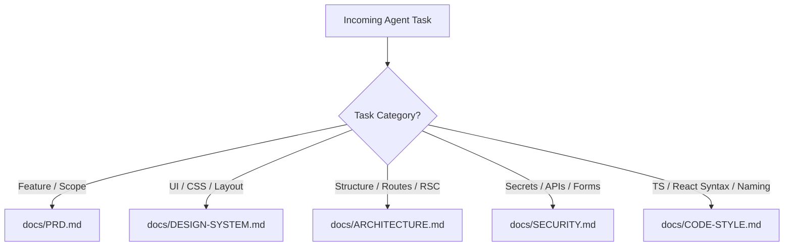
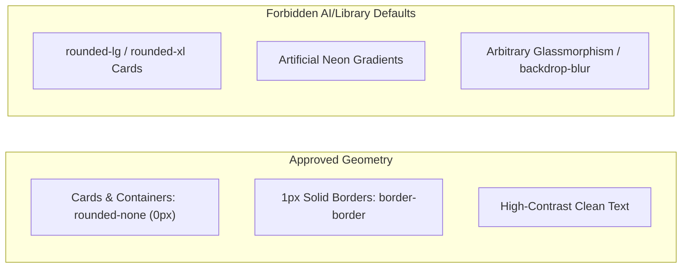
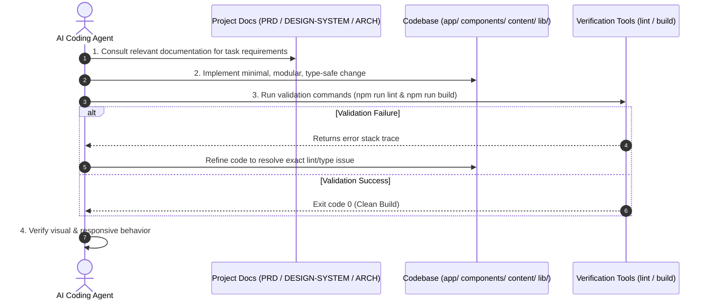
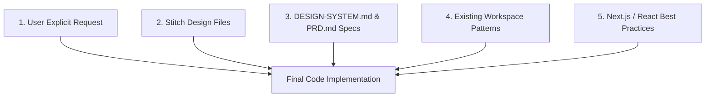

# Agent Operating Directives — Shreyansh Patni Portfolio

> [!IMPORTANT]
> **Source of Truth Hierarchy**:
> 1. User's Explicit Instructions
> 2. **Stitch Design Files** (Desktop / Tablet / Mobile — Light & Dark Modes)
> 3. [`DESIGN-SYSTEM.md`](file:///c:/Users/shrey/Downloads/shreyansh-portfolio/shreyansh-portfolio/docs/DESIGN-SYSTEM.md)
> 4. [`PRD.md`](file:///c:/Users/shrey/Downloads/shreyansh-portfolio/shreyansh-portfolio/docs/PRD.md)
> 5. [`ARCHITECTURE.md`](file:///c:/Users/shrey/Downloads/shreyansh-portfolio/shreyansh-portfolio/docs/ARCHITECTURE.md)
> 6. [`SECURITY.md`](file:///c:/Users/shrey/Downloads/shreyansh-portfolio/shreyansh-portfolio/docs/SECURITY.md)
> 7. [`CODE-STYLE.md`](file:///c:/Users/shrey/Downloads/shreyansh-portfolio/shreyansh-portfolio/docs/CODE-STYLE.md)

---

## 1. Project Context & Purpose

This repository contains the personal digital profile, developer portfolio, founder showcase, and content platform for **Shreyansh Patni**.

The website is engineered to communicate technical capability, founder track record (Sahaya SaaS/Agency & th3.media brand network), and educational background (PES University & GTU) with high visual fidelity based strictly on supplied Stitch design specifications.

---

## 2. Pre-Execution Task Lookup Matrix

Before initiating edits, AI agents must consult the specific documentation governing that domain:

### 2.1 Documentation Reference Table

| Task Domain | Primary Target Document | Key Areas Covered |
| :--- | :--- | :--- |
| **Product Scope & Content** | [`docs/PRD.md`](file:///c:/Users/shrey/Downloads/shreyansh-portfolio/shreyansh-portfolio/docs/PRD.md) | Business background, section definitions, owner profile facts, roadmap |
| **Visual UI & Styling** | [`docs/DESIGN-SYSTEM.md`](file:///c:/Users/shrey/Downloads/shreyansh-portfolio/shreyansh-portfolio/docs/DESIGN-SYSTEM.md) | Stitch fidelity, sharp geometry (`0px` radius), color tokens, typography |
| **Architecture & Structure** | [`docs/ARCHITECTURE.md`](file:///c:/Users/shrey/Downloads/shreyansh-portfolio/shreyansh-portfolio/docs/ARCHITECTURE.md) | App Router, RSC vs. Client boundaries, file organization, API adapters |
| **Security & Credentials** | [`docs/SECURITY.md`](file:///c:/Users/shrey/Downloads/shreyansh-portfolio/shreyansh-portfolio/docs/SECURITY.md) | Secret governance, API isolation, input validation, CORS/CSRF safety |
| **Code Style & Syntax** | [`docs/CODE-STYLE.md`](file:///c:/Users/shrey/Downloads/shreyansh-portfolio/shreyansh-portfolio/docs/CODE-STYLE.md) | TypeScript typing, clean React patterns, Tailwind utility rules, imports |

---

## 3. Non-Negotiable Agent Guardrails

### 3.1 Design Fidelity & Sharp Geometry Rule

> [!CAUTION]
> **No Generic Rounded UI**: The design relies on **sharp rectangular geometry (`0px` border radius)**.
> **DO NOT** use `rounded-lg`, `rounded-xl`, or generic card templates simply because a UI library defaults to them.

### 3.2 Strict Anti-Fabrication Policy
- **Never Invent Facts**: Do not fabricate job titles, client logos, revenue numbers, awards, hackathon rankings, user metrics, or credentials for Shreyansh Patni.
- **Data-Driven Content**: All personal details must originate strictly from structured content files inside `content/*.ts`. If data is missing, use a clear placeholder or request clarification.

### 3.3 Server Component First Architecture
- **Default to RSC**: All components in `app/` and `components/` are React Server Components by default.
- **Minimal Client Boundary**: Apply `"use client"` strictly at the lowest leaf component level required for interactivity or theme state. Never mark entire section containers as client components without necessity.

### 3.4 API Integration Isolation & Secrets Security
- **Server-Side Credentials**: API tokens (GitHub, Spotify, X) must remain in server-side environment variables (`.env.local`). Never expose secrets via `NEXT_PUBLIC_`.
- **Graceful API Fallbacks**: Third-party API failures must never crash the page layout. Always return normalized fallback objects.

---

## 4. Agent Execution Workflow

---

## 5. Decision Priority Hierarchy

When resolving conflicts or technical ambiguities during execution, follow this explicit decision priority tree:

---

## 6. Agent Definition of Done Checklist

Before declaring a task resolved, AI agents must verify:

- [ ] **Type Safety**: All TypeScript interfaces pass type checking without resorting to `any`.
- [ ] **Design Compliance**: UI matches the sharp geometry (`rounded-none`), spacing, and color tokens defined in [`DESIGN-SYSTEM.md`](file:///c:/Users/shrey/Downloads/shreyansh-portfolio/shreyansh-portfolio/docs/DESIGN-SYSTEM.md).
- [ ] **Content Integrity**: No personal data or credentials have been fabricated or hardcoded into JSX blocks.
- [ ] **Component Boundaries**: Client boundaries (`"use client"`) are minimal and isolated.
- [ ] **Lint & Build Pass**: `npm run lint` and `npm run build` execute cleanly with exit code 0.
