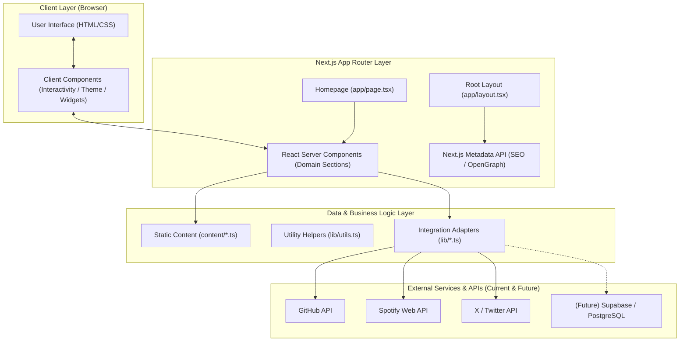
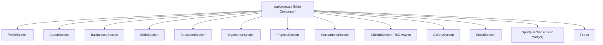
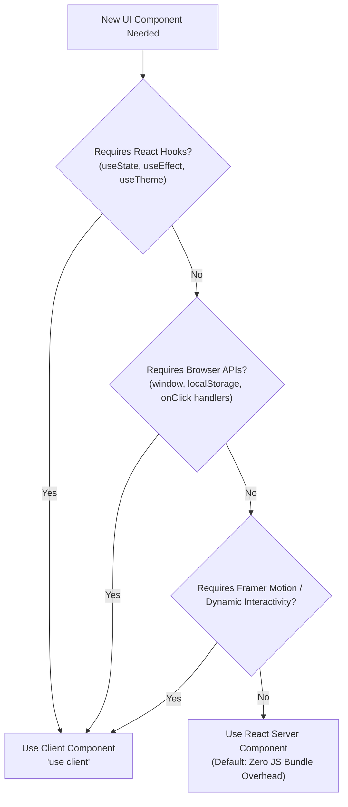
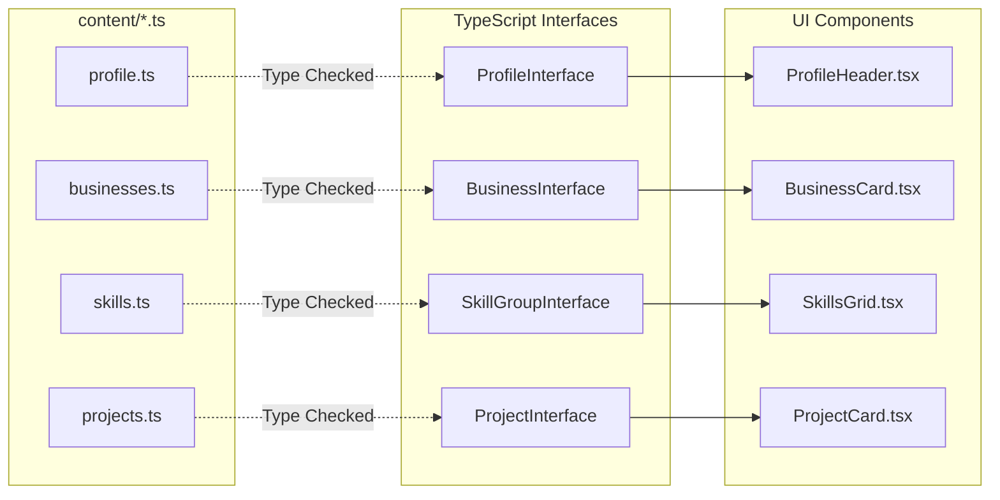
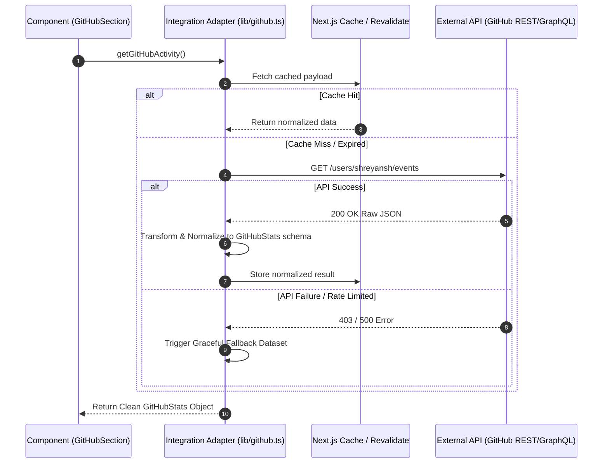
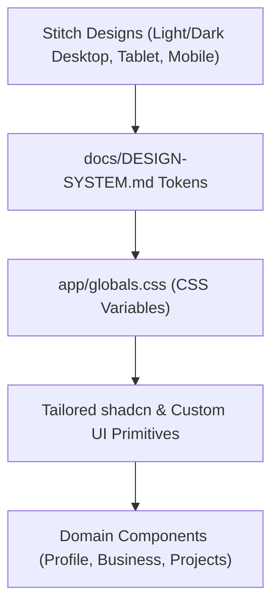
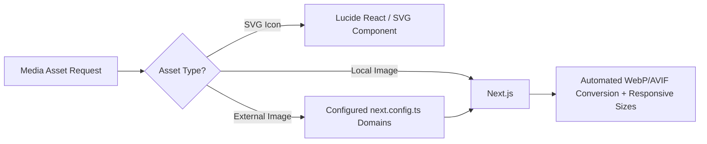
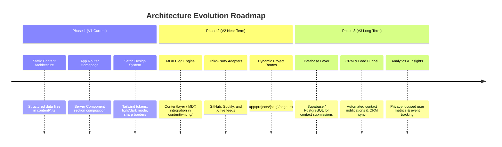

# Architecture Specification — Shreyansh Patni Portfolio

> [!IMPORTANT]
> **Source of Truth Hierarchy**:
> 1. Actual Stitch Design Files (Desktop / Tablet / Mobile — Light & Dark)
> 2. [`DESIGN-SYSTEM.md`](file:///c:/Users/shrey/Downloads/shreyansh-portfolio/shreyansh-portfolio/docs/DESIGN-SYSTEM.md)
> 3. [`PRD.md`](file:///c:/Users/shrey/Downloads/shreyansh-portfolio/shreyansh-portfolio/docs/PRD.md)
> 4. `AGENTS.md`
> 5. **`ARCHITECTURE.md` (This Document)**

---

## 1. Executive Summary & Goals

This document defines the software architecture for the **Shreyansh Patni Personal Portfolio and Digital Profile Platform**.

### 1.1 Architectural Purpose
The primary architectural goal is to construct a **modular, scalable, highly maintainable personal digital profile platform** built on the Next.js App Router. The platform must launch as a fast, mostly static portfolio while providing explicit architectural primitives to seamlessly evolve into a dynamic platform featuring third-party API integrations (GitHub, Spotify, X), blog engine (MDX/CMS), lead capture, database persistence, and analytics without requiring structural refactoring.

### 1.2 Core Architectural Principles

| Principle | Description |
| :--- | :--- |
| **Separation of Concerns** | UI components are strictly visual. Personal data, business profiles, and project metadata are decoupled in structured data files. |
| **Server-First Rendering** | Default to React Server Components (RSC) to minimize bundle sizes, maximize SEO, and improve initial load speeds. |
| **Minimal Client Boundaries** | Client components (`"use client"`) are strictly scoped to interactive widgets, stateful controls, and browser API integrations. |
| **Resilient API Architecture** | External third-party APIs (GitHub, Spotify, X) are isolated behind internal normalization handlers with graceful degradation. |
| **Design System Fidelity** | Visual implementation strictly follows the Stitch design specifications over default library styles (shadcn/ui, Magic UI). |

---

## 2. High-Level Architecture

The overall application architecture follows a tiered structure: Presentation Layer (Next.js App Router & Server Components), Domain Layer (Structured Content & Custom Hooks), Integration Layer (API Adapters & Normalizers), and Data/External Services (Static TS Data, Third-party APIs, and Future Persistence).



---

## 3. Technology Stack & Specifications

### 3.1 Primary Stack

| Category | Technology | Version / Spec | Purpose |
| :--- | :--- | :--- | :--- |
| **Framework** | Next.js | 16+ (App Router) | Core application framework & file-system routing |
| **UI Library** | React | 19+ | UI component architecture |
| **Language** | TypeScript | 5+ | Static typing & interface definitions |
| **Styling** | Tailwind CSS | 4+ | Utility-first CSS & design token implementation |
| **Component Foundation** | shadcn/ui | Tailored | Accessible low-level primitives (buttons, dialogs, dropdowns) |
| **Special FX** | Magic UI | Selective | Accent animations matching Stitch design |
| **Icons** | Lucide React | Latest | Consistent UI iconography |
| **Theme System** | `next-themes` | Latest | Light / Dark mode state management |
| **Package Manager** | `npm` | Native | Package dependency management |
| **Hosting & CI/CD** | Vercel & GitHub | Continuous Deployment | Automated builds, edge distribution, preview environments |

> [!NOTE]
> **Future Stack Additions** (Deploy only when required by feature roadmap):
> - **Database**: Supabase / PostgreSQL (for lead management & contact storage)
> - **Content**: MDX (for writing & technical blog posts)
> - **Analytics**: Vercel Analytics / PostHog (privacy-focused usage metrics)

---

## 4. Directory & Project Structure

The project structure enforces clean boundaries between routing, visual components, content schemas, and helper utilities.

```text
shreyansh-portfolio/
│
├── .agents/                    # AI Agent configurations & workspace rules
├── app/                        # Next.js App Router (Routes & Page Composers)
│   ├── about/                  # (Future) Standalone About Page
│   │   └── page.tsx
│   ├── projects/               # (Future) Project Directory Page
│   │   ├── page.tsx
│   │   └── [slug]/             # (Future) Dynamic Project Detail Page
│   │       └── page.tsx
│   ├── writing/                # (Future) Writing / Blog Directory Page
│   │   ├── page.tsx
│   │   └── [slug]/             # (Future) MDX Blog Post Page
│   │       └── page.tsx
│   ├── contact/                # (Future) Standalone Contact Page
│   │   └── page.tsx
│   ├── favicon.ico             # Application favicon
│   ├── globals.css             # Global CSS, CSS variables, & Tailwind directives
│   ├── layout.tsx              # Root Layout (Providers, Fonts, Global Metadata)
│   └── page.tsx                # Homepage Composition Layer
│
├── components/                 # React UI Components (Domain Organized)
│   ├── profile/                # Hero, Profile Card, Banner, Social Links
│   ├── businesses/             # Business Cards (Sahaya, th3.media, Products)
│   ├── skills/                 # Developer Skills Grid & Categorized Tech Stack
│   ├── education/              # Academic Credentials & Institutional Data
│   ├── experience/             # Career History & Leadership Roles
│   ├── projects/               # Project Showcase Cards & Interactive Filters
│   ├── hackathons/             # Hackathon Achievements & Awards
│   ├── github/                 # GitHub Activity Grid & Contribution Feed
│   ├── gallery/                # Selected Visual Highlights & Photography Grid
│   ├── social/                 # Social Presence Hub & Embeds
│   ├── blog/                   # Blog Preview & Writing Cards
│   ├── spotify/                # Live Spotify Currently Playing Widget
│   ├── contact/                # Contact Section & Lead Generation Form
│   ├── footer/                 # Site Footer & Copyright Notice
│   └── ui/                     # Low-level primitives (shadcn tailored primitives)
│
├── content/                    # Structured Static Data (Single Source of Truth for Content)
│   ├── profile.ts              # Personal metadata, bio, tags, social links
│   ├── businesses.ts           # Business info (Sahaya, th3.media, SaaS products)
│   ├── skills.ts               # Categorized skills matrix
│   ├── education.ts            # Academic qualifications & institutions
│   ├── experience.ts           # Work experience timeline
│   ├── projects.ts             # Featured projects, repositories, descriptions
│   └── hackathons.ts           # Hackathon wins, projects, dates
│
├── lib/                        # Integration Adapters, Utilities & Clients
│   ├── utils.ts                # Tailwind class merge helper (`cn`), string formatters
│   ├── github.ts               # GitHub REST/GraphQL API fetcher & transformer
│   ├── spotify.ts              # Spotify API authentication & currently-playing adapter
│   └── x.ts                    # X (Twitter) API feed integration adapter
│
├── public/                     # Static Public Assets
│   ├── images/                 # Profile avatars, banners, logos
│   ├── projects/               # Project screenshots & thumbnails
│   ├── gallery/                # Photo gallery assets
│   └── certificates/           # Education & achievement verification badges
│
├── docs/                       # Project Documentation Architecture
│   ├── PRD.md                  # Product Requirements Document
│   ├── DESIGN-SYSTEM.md        # Design System Specification
│   ├── ARCHITECTURE.md         # Application Architecture Specification (This File)
│   ├── SECURITY.md             # (Future) Security Guidelines
│   ├── DATABASE.md             # (Future) Database Schema Specification
│   └── API-GUIDE.md            # (Future) API Integration Guide
│
├── AGENTS.md                   # Agent system rules & workspace directives
├── components.json             # shadcn/ui configuration file
├── package.json                # Project dependencies & scripts
├── postcss.config.mjs          # PostCSS configuration for Tailwind v4
├── next.config.ts              # Next.js build configuration & image domains
└── tsconfig.json               # TypeScript path aliases & compiler options
```

---

## 5. Homepage & Component Composition

### 5.1 Composition Layer Pattern
The primary entry point (`app/page.tsx`) acts strictly as an **architectural composer**. It contains no raw data arrays, inline styling blocks, or complex DOM trees.



### 5.2 Declarative Homepage Implementation
```tsx
// app/page.tsx
import { ProfileSection } from "@/components/profile/profile-section";
import { AboutSection } from "@/components/profile/about-section";
import { BusinessesSection } from "@/components/businesses/businesses-section";
import { SkillsSection } from "@/components/skills/skills-section";
import { EducationSection } from "@/components/education/education-section";
import { ExperienceSection } from "@/components/experience/experience-section";
import { ProjectsSection } from "@/components/projects/projects-section";
import { HackathonsSection } from "@/components/hackathons/hackathons-section";
import { GitHubSection } from "@/components/github/github-section";
import { GallerySection } from "@/components/gallery/gallery-section";
import { SocialSection } from "@/components/social/social-section";
import { SpotifySection } from "@/components/spotify/spotify-section";
import { Footer } from "@/components/footer/footer";

export default function HomePage() {
  return (
    <main className="flex min-h-screen flex-col items-center w-full bg-background text-foreground">
      <div className="w-full max-w-4xl px-4 sm:px-6 lg:px-8 py-8 space-y-16">
        <ProfileSection />
        <AboutSection />
        <BusinessesSection />
        <SkillsSection />
        <EducationSection />
        <ExperienceSection />
        <ProjectsSection />
        <HackathonsSection />
        <GitHubSection />
        <GallerySection />
        <SocialSection />
        <SpotifySection />
        <Footer />
      </div>
    </main>
  );
}
```

---

## 6. Server vs. Client Component Strategy

> [!TIP]
> **Server Component First Strategy**: Default all components to React Server Components (RSC). Only add `"use client"` when browser-specific execution is mandatory.



### 6.1 Component Classification Matrix

| Component | Rendering Strategy | Justification |
| :--- | :--- | :--- |
| `app/layout.tsx` | **Server Component** | Provides root HTML structure, metadata, and font loading. |
| `ThemeProvider` | **Client Component** | Manages DOM `class="dark"` mutations and theme context. |
| `ProfileSection` | **Server Component** | Renders static profile bio and social badges from local TS data. |
| `BusinessesSection` | **Server Component** | Renders business cards and product lists statically. |
| `GitHubSection` | **Server Component** | Fetches public GitHub statistics at build/revalidation time on the server. |
| `SpotifySection` | **Client Component** | Polls live playback status or connects via SSE/WebSocket. |
| `ContactForm` | **Client Component** | Manages form inputs, client-side validation, submit state, and feedback toast. |

---

## 7. Content Architecture & Data Schemas

To prevent UI component clutter and enable future CMS/Database migration, all content is stored in strongly-typed TypeScript modules inside `content/`.



### 7.1 Schema Specifications

#### Profile Schema (`content/profile.ts`)
```ts
export interface ProfileLink {
  label: string;
  url: string;
  icon: string;
  isPrimary?: boolean;
}

export interface ProfileData {
  name: string;
  handle: string;
  title: string;
  bio: string;
  avatarUrl: string;
  bannerUrl: string;
  location: string;
  statusText: string;
  isAvailableForWork: boolean;
  socialLinks: ProfileLink[];
}
```

#### Business Schema (`content/businesses.ts`)
```ts
export interface BusinessProduct {
  id: string;
  name: string;
  description: string;
  url?: string;
  tag?: string;
}

export interface BusinessData {
  id: string;
  name: string;
  tagline: string;
  description: string;
  logoUrl: string;
  websiteUrl: string;
  role: string;
  products: BusinessProduct[];
}
```

#### Projects Schema (`content/projects.ts`)
```ts
export interface ProjectData {
  id: string;
  title: string;
  slug: string;
  description: string;
  tags: string[];
  githubUrl?: string;
  demoUrl?: string;
  featured: boolean;
  imageUrl: string;
}
```

---

## 8. Third-Party API Integration Pipelines

All external API dependencies are encapsulated inside isolated service adapters within `lib/`. The visual layer **never** interacts directly with un-normalized external API responses.



### 8.1 API Resilience Rules

> [!WARNING]
> **Graceful Degradation Guarantee**: A failure in a third-party API (e.g., Spotify API down, GitHub rate-limited, X API outage) **MUST NEVER** throw an uncaught exception or crash the portfolio homepage.

1. **Server-Side Credentials**: API tokens and OAuth client secrets must reside exclusively in environment variables (`.env.local`) and never be exposed via `NEXT_PUBLIC_` prefixes.
2. **Revalidation & Caching**: Use Next.js extended `fetch` with appropriate `revalidate` intervals (e.g., 3600 seconds for GitHub stats, 30 seconds for Spotify).
3. **Fallback Payload Guarantee**: Every adapter must include fallback mock objects that gracefully display when external APIs fail or are unreachable.

---

## 9. Design System & Component Integration

### 9.1 Source of Truth Enforcement
The visual implementation strictly implements the custom Stitch designs detailed in [`DESIGN-SYSTEM.md`](file:///c:/Users/shrey/Downloads/shreyansh-portfolio/shreyansh-portfolio/docs/DESIGN-SYSTEM.md).



### 9.2 Component Layering Guidelines

| Layer | Path | Purpose | Customization Directive |
| :--- | :--- | :--- | :--- |
| **Primitives** | `components/ui/` | Base UI controls (Button, Dialog, Badge) | Strip default rounded corners (`rounded-lg`) to match sharp Stitch geometry (1px borders, sharp edges). |
| **Domain UI** | `components/[domain]/` | Specific portfolio blocks | Implement exact layout, typography, and contrast defined in Stitch references. |
| **Composition** | `app/page.tsx` | Assembles sections | Applies max container widths (`max-w-4xl`), vertical rhythm, and global margins. |

---

## 10. Routing & Metadata Architecture

### 10.1 App Router File-System Mapping

```text
URL Route               App Router Handler                  Status
/                       app/page.tsx                        Active (V1)
/about                  app/about/page.tsx                  Planned (V2)
/projects               app/projects/page.tsx               Planned (V2)
/projects/[slug]        app/projects/[slug]/page.tsx        Planned (V2)
/writing                app/writing/page.tsx                Planned (V2)
/writing/[slug]         app/writing/[slug]/page.tsx         Planned (V2)
/contact                app/contact/page.tsx                Planned (V2)
```

### 10.2 Next.js Metadata API Integration
Global and page-level metadata are defined using declarative TypeScript constants in `app/layout.tsx` and individual routes:

```typescript
// app/layout.tsx
import type { Metadata } from "next";

export const metadata: Metadata = {
  title: {
    default: "Shreyansh Patni — Developer & Founder",
    template: "%s | Shreyansh Patni",
  },
  description: "Personal portfolio, founder showcase, and developer profile of Shreyansh Patni.",
  keywords: ["Shreyansh Patni", "Developer", "Founder", "Sahaya", "PES University", "Portfolio"],
  authors: [{ name: "Shreyansh Patni" }],
  openGraph: {
    type: "website",
    locale: "en_US",
    url: "https://shreyanshpatni.com",
    title: "Shreyansh Patni — Developer & Founder",
    description: "Personal portfolio, founder showcase, and developer profile.",
    siteName: "Shreyansh Patni Portfolio",
  },
  twitter: {
    card: "summary_large_image",
    title: "Shreyansh Patni — Developer & Founder",
    creator: "@shreyanshpatni",
  },
  robots: {
    index: true,
    follow: true,
  },
};
```

---

## 11. Asset Optimization & Performance Strategy



### 11.1 Image Handling Directives
1. **Next.js `<Image />` Standard**: Raw `` HTML tags are prohibited for portfolio assets. Always use `next/image`.
2. **Dimension Explicit Mode**: Always specify explicit `width` and `height` properties or use `fill` with `sizes` to eliminate Cumulative Layout Shift (CLS).
3. **Priority Loading**: Restrict `priority={true}` strictly to the primary Hero Profile Avatar image above the fold.
4. **Domain Whitelisting**: External remote images (e.g., GitHub avatars, Spotify album covers) must be whitelisted in `next.config.ts`.

---

## 12. Security Architecture & Secrets Governance

```text
+-------------------------------------------------------------------+
|                        SECURITY BOUNDARY                          |
|                                                                   |
|   SERVER-ONLY ENVIRONMENT (.env.local)                           |
|   - SPOTIFY_CLIENT_SECRET                                         |
|   - GITHUB_PAT_TOKEN                                              |
|   - DATABASE_URL                                                  |
|                                                                   |
|   ===================== NEVER EXPOSED =========================   |
|                                                                   |
|   CLIENT-SAFE ENVIRONMENT (NEXT_PUBLIC_*)                         |
|   - NEXT_PUBLIC_SITE_URL                                          |
|   - NEXT_PUBLIC_ANALYTICS_ID                                      |
+-------------------------------------------------------------------+
```

> [!CAUTION]
> **Secrets Exposure Warning**: Never prefix API secrets or database connection strings with `NEXT_PUBLIC_`. All private keys must remain exclusively accessible to server runtime code.

For complete details on credentials safety protocols, refer to [`SECURITY.md`](file:///c:/Users/shrey/Downloads/shreyansh-portfolio/shreyansh-portfolio/docs/SECURITY.md).

---

## 13. Future Roadmap & Scalability Matrix



---

## 14. Definition of Architectural Done

An architectural feature, section, or refactor is considered **Complete and Healthy** when:

- [x] **Modular Structure**: The section lives in its dedicated `components/[domain]/` folder.
- [x] **Decoupled Data**: No hardcoded personal content exists directly inside component render blocks.
- [x] **Type Safety**: All props and data imports pass strict TypeScript validation (`npm run build`).
- [x] **Boundary Discipline**: `"use client"` is applied only where interactive browser state is required.
- [x] **Stitch Alignment**: Spacing, borders, colors, and typography match [`DESIGN-SYSTEM.md`](file:///c:/Users/shrey/Downloads/shreyansh-portfolio/shreyansh-portfolio/docs/DESIGN-SYSTEM.md).
- [x] **Resilience**: The section handles loading, empty, and error states gracefully without breaking the layout.
- [x] **Zero Build Errors**: Clean execution of `npm run build` and `npm run lint`.
