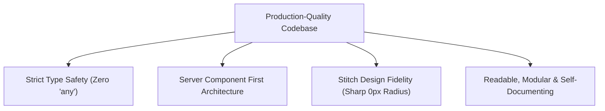
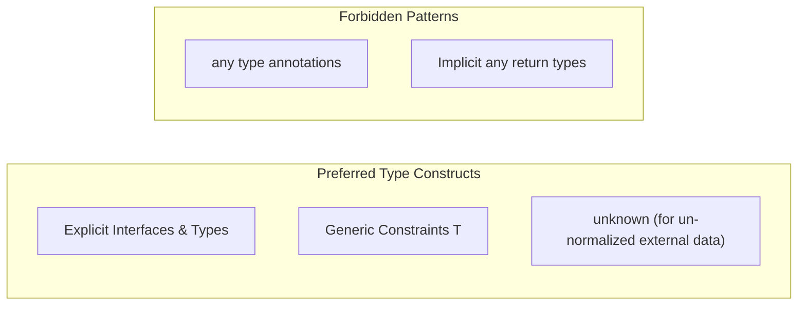
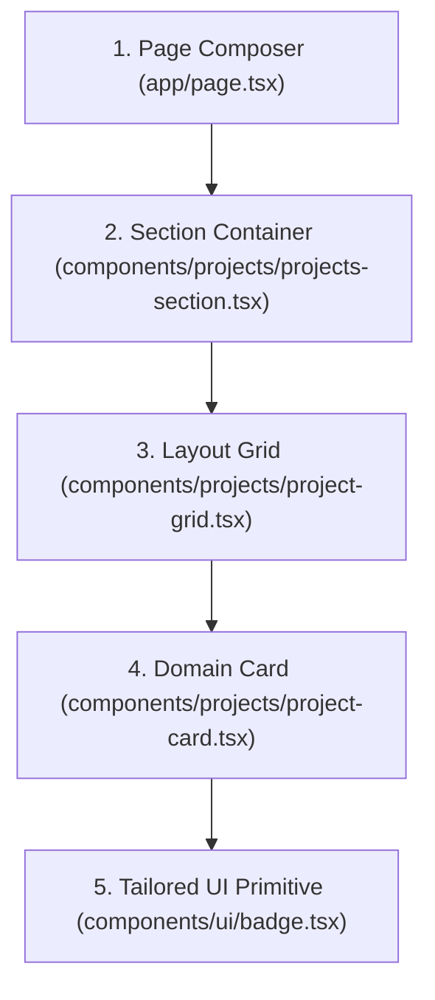
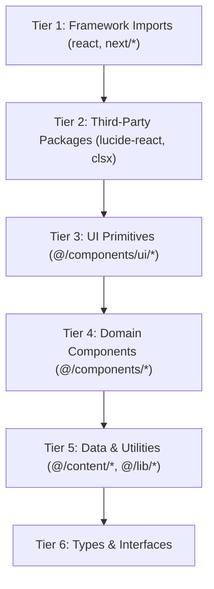

# Code Style Specification — Shreyansh Patni Portfolio

> [!IMPORTANT]
> **Source of Truth Hierarchy**:
> 1. User's Explicit Request
> 2. **`CODE-STYLE.md` (This Document)**
> 3. [`DESIGN-SYSTEM.md`](file:///c:/Users/shrey/Downloads/shreyansh-portfolio/shreyansh-portfolio/docs/DESIGN-SYSTEM.md)
> 4. [`ARCHITECTURE.md`](file:///c:/Users/shrey/Downloads/shreyansh-portfolio/shreyansh-portfolio/docs/ARCHITECTURE.md)
> 5. `AGENTS.md`

---

## 1. Purpose & Core Engineering Philosophy

This document defines the coding conventions, type safety rules, component standards, and formatting guidelines for the Shreyansh Patni Portfolio codebase.



---

## 2. Language & Type Safety Standards

### 2.1 Language Specification
- **Primary Language**: TypeScript (`.ts` / `.tsx`).
- **No JavaScript**: Do not write `.js` or `.jsx` files for application code.
- **Strict Typing**: Prefer explicit interfaces and generics over loose types.

### 2.2 Strict Type Hierarchy (Avoid `any`)



#### Good vs. Bad Type Definitions

```ts
// ❌ BAD: Loose typing with any
const fetchProject = (id: any): any => {
  return data;
};

// ✅ GOOD: Explicit, strongly typed interfaces
export interface Project {
  id: string;
  title: string;
  slug: string;
  description: string;
  tags: string[];
  githubUrl?: string;
  demoUrl?: string;
  featured: boolean;
}

export async function fetchProject(id: string): Promise<Project | null> {
  // Safe fetching logic
}
```

### 2.3 Naming Conventions

| Construct | Case Convention | Examples |
| :--- | :--- | :--- |
| **React Components** | `PascalCase` | `ProfileSection`, `BusinessCard`, `ProjectGrid` |
| **Component Files** | `kebab-case.tsx` | `profile-section.tsx`, `business-card.tsx` |
| **Types / Interfaces** | `PascalCase` | `ProfileData`, `BusinessProduct`, `Project` |
| **Variables & Functions** | `camelCase` | `projectCount`, `formatDate`, `getGitHubStats` |
| **Global Constants** | `UPPER_SNAKE_CASE` | `MAX_FEATURED_PROJECTS`, `DEFAULT_REVALIDATE_SECONDS` |

---

## 3. Component Architecture & React Standards

### 3.1 Component Hierarchy & Responsibilities



### 3.2 Server vs. Client Component Strategy
1. **Server Components Default**: All files in `app/` and `components/` are React Server Components (RSC) unless explicitly marked with `"use client"`.
2. **Minimal Client Boundaries**: Scope `"use client"` exclusively to leaf components requiring interactive state (theme toggle, interactive modal, playback polling widget).

```tsx
// ❌ BAD: Marking an entire section layout as a client component
"use client";
export function ProjectsSection() {
  return <section>...</section>;
}

// ✅ GOOD: Server component section rendering minimal client widgets
import { ProjectCard } from "./project-card";
import { projects } from "@/content/projects";

export function ProjectsSection() {
  return (
    <section className="space-y-6">
      <h2 className="text-xl font-medium text-foreground">Projects</h2>
      <div className="grid gap-4 sm:grid-cols-2">
        {projects.map((project) => (
          <ProjectCard key={project.id} {...project} />
        ))}
      </div>
    </section>
  );
}
```

---

## 4. Styling & Tailwind CSS Conventions

### 4.1 Utility-First & Class Merging (`cn`)
Use Tailwind CSS utility classes directly in JSX. Use the project's `cn` utility (`clsx` + `tailwind-merge`) when combining conditional classes.

```tsx
import { cn } from "@/lib/utils";

interface BadgeProps {
  variant?: "default" | "outline";
  className?: string;
  children: React.ReactNode;
}

export function Badge({ variant = "default", className, children }: BadgeProps) {
  return (
    <span
      className={cn(
        "inline-flex items-center px-2 py-0.5 text-xs font-mono border border-border rounded-none transition-colors",
        variant === "default" && "bg-muted text-muted-foreground",
        variant === "outline" && "bg-transparent text-foreground border-foreground/30",
        className
      )}
    >
      {children}
    </span>
  );
}
```

### 4.2 Sharp Geometry Enforcement
> [!CAUTION]
> **Strict Geometry Directive**: Always override default UI library border radii with `rounded-none` (0px radius) to maintain fidelity with Stitch designs.

---

## 5. Import Ordering & Path Aliases

Imports must be cleanly grouped into 6 logical tiers separated by a single newline.



```tsx
// Standardized Import Block Example
import Image from "next/image";
import Link from "next/link";

import { ArrowUpRight, Github } from "lucide-react";

import { Badge } from "@/components/ui/badge";
import { BusinessCard } from "@/components/businesses/business-card";
import { businesses } from "@/content/businesses";
import { cn, formatDate } from "@/lib/utils";

import type { BusinessData } from "@/content/businesses";
```

> [!TIP]
> **Path Alias Directive**: Always use `@/*` for internal repository paths instead of nested relative paths (`../../../components/...`).

---

## 6. Semantic HTML & Accessibility Standards (WCAG 2.1 AA)

1. **Semantic Container Tags**: Use `<main>`, `<section>`, `<header>`, `<footer>`, and `<article>` instead of generic `<div>` blocks.
2. **Buttons vs. Links**: Use `<button>` for user actions/triggers; use Next.js `<Link>` for navigation. Never create clickable `<div>` elements without ARIA roles.
3. **Accessible Images**: Always use `next/image` with descriptive `alt` text. Use `alt=""` only for purely decorative graphic dividers.
4. **Keyboard Focus States**: Preserve visible focus rings (`focus-visible:ring-1 focus-visible:ring-ring`) on interactive elements.

```tsx
// ✅ GOOD: Semantic, Accessible Button Component
export function ActionButton({ label, onClick }: { label: string; onClick: () => void }) {
  return (
    <button
      type="button"
      onClick={onClick}
      aria-label={label}
      className="inline-flex items-center justify-center px-4 py-2 text-sm font-medium border border-border bg-card hover:bg-accent text-foreground focus-visible:outline-none focus-visible:ring-1 focus-visible:ring-foreground rounded-none transition-colors"
    >
      {label}
    </button>
  );
}
```

---

## 7. Error Handling & API Integration Standards

1. **Never Swallow Errors**: Handle async errors explicitly with fallbacks or user notifications instead of empty `catch {}` blocks.
2. **Normalized API Payloads**: Transform third-party API payloads (GitHub, Spotify, X) into clean domain objects before passing them to UI components.

```typescript
// lib/github.ts
export interface GitHubStats {
  publicRepos: number;
  followers: number;
  totalStars: number;
}

export async function getGitHubStats(username: string): Promise<GitHubStats> {
  try {
    const res = await fetch(`https://api.github.com/users/${username}`, {
      next: { revalidate: 3600 },
    });

    if (!res.ok) {
      throw new Error(`GitHub API returned status ${res.status}`);
    }

    const data = await res.json();
    return {
      publicRepos: data.public_repos ?? 0,
      followers: data.followers ?? 0,
      totalStars: 0, // Computed from repos
    };
  } catch (error) {
    console.error("Failed to fetch GitHub statistics:", error);
    // Graceful fallback payload
    return {
      publicRepos: 0,
      followers: 0,
      totalStars: 0,
    };
  }
}
```

---

## 8. Developer Verification & Pre-Commit Audit Checklist

Before submitting code changes, execute this verification audit:

- [ ] **Type Check**: Does the code compile cleanly without any `any` types?
- [ ] **Lint Check**: Does `npm run lint` execute with 0 errors or warnings?
- [ ] **Build Check**: Does `npm run build` produce a successful production build?
- [ ] **Geometry Check**: Are UI elements styled with sharp geometry (`rounded-none` / 0px radius)?
- [ ] **Semantic Check**: Are semantic HTML tags (`<section>`, `<main>`, `<button>`) used appropriately?
- [ ] **Import Check**: Are imports organized using path aliases (`@/...`) and ordered by tier?
