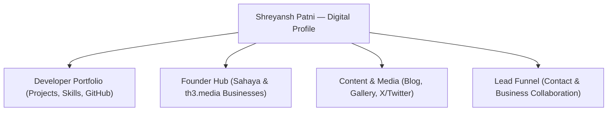
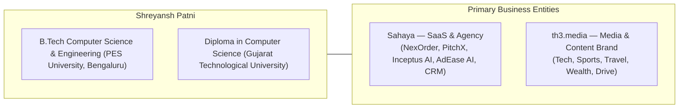
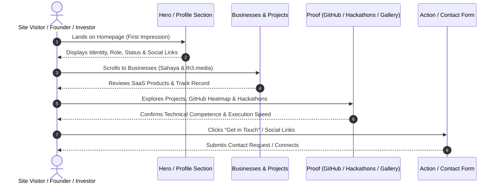
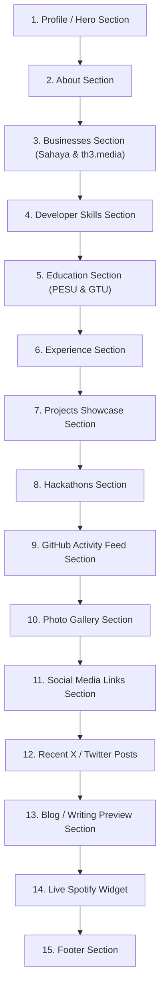
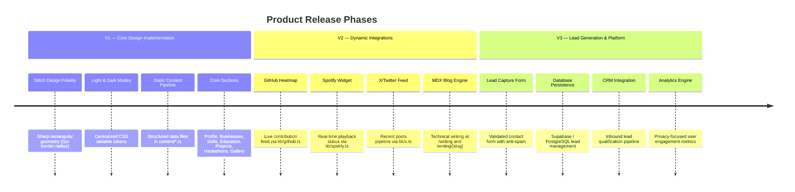

# Product Requirements Document (PRD) — Shreyansh Patni Portfolio

> [!IMPORTANT]
> **Source of Truth Hierarchy**:
> 1. **Stitch Design Files** (Desktop / Tablet / Mobile — Light & Dark Modes)
> 2. [`DESIGN-SYSTEM.md`](file:///c:/Users/shrey/Downloads/shreyansh-portfolio/shreyansh-portfolio/docs/DESIGN-SYSTEM.md)
> 3. **`PRD.md` (This Document)**
> 4. [`ARCHITECTURE.md`](file:///c:/Users/shrey/Downloads/shreyansh-portfolio/shreyansh-portfolio/docs/ARCHITECTURE.md)
> 5. `AGENTS.md`

---

## 1. Product Vision & Overview

### 1.1 Product Purpose
Build a modern, high-credibility personal digital profile and portfolio platform for **Shreyansh Patni**. 

Unlike standard developer portfolio templates or corporate SaaS landing pages, this platform functions as a **unified digital identity hub** showcasing developer achievements, founder/business ventures, technical projects, content properties, and a lead-generation funnel.

### 1.2 Core Product Objectives

| Objective | Description | Success Metric |
| :--- | :--- | :--- |
| **Credibility & Identity** | Establish Shreyansh as a skilled developer, builder, and founder | High initial visual impact matching Stitch reference |
| **Business Showcase** | Display confirmed businesses (Sahaya, th3.media) and SaaS products | Data-driven business section with zero hardcoded visual fluff |
| **Technical Portfolio** | Present verified technical projects, hackathons, and skills | Complete project detail cards with live & GitHub links |
| **Audience Engagement** | Provide links to social channels, dynamic feeds, and photography | Smooth responsive interactions across all viewports |
| **Lead Capture** | Channel inbound inquiries into business opportunities | Functional contact funnel & validated submission pipeline |

---

## 2. Owner Profile & Fact Sheet

> [!WARNING]
> **Strict Anti-Fabrication Rule**: Do not invent jobs, revenue numbers, client lists, awards, follower counts, or credentials. Only display information confirmed in structured content files (`content/*.ts`).

### 2.1 Owner Profile Matrix

| Field | Confirmed Details |
| :--- | :--- |
| **Full Name** | Shreyansh Patni |
| **Positioning** | Computer Science Student, Developer, Founder, Builder, Entrepreneur |
| **Current Education** | B.Tech in Computer Science & Engineering — **PES University, Bengaluru** |
| **Prior Education** | Diploma in Computer Science — **Gujarat Technological University (GTU)** |
| **Primary Business 1** | **Sahaya** — SaaS technology & agency (Products: NexOrder, Sahaya Inventory, PitchX, Inceptus AI, AdEase AI, Real Estate CRM, HRM/Billing) |
| **Primary Business 2** | **th3.media** — Content & media network (Properties across Technology, Sports, Travel, Wealth, Drive) |

---

## 3. Target Audience & User Journeys

### 3.1 Target Audience Matrix

| Target Group | Primary Goal on Site | Desired User Experience |
| :--- | :--- | :--- |
| **Founders & Operators** | Evaluate Shreyansh for partnerships or SaaS products | Premium, technical, founder-level credibility |
| **Investors & VCs** | Review track record, businesses, and execution speed | Concise, metric-backed project & business cards |
| **Developers & Tech Peers** | Inspect code quality, GitHub activity, stack proficiency | Sharp, technical UI, clean GitHub heatmap, open-source links |
| **Potential Clients** | Hire Sahaya or collaborate on custom software | Clear value proposition, fast contact path |
| **Recruiters & Academic** | Verify education, hackathons, and technical experience | Structured timeline, verified academic credentials |

### 3.2 User Journey Flowchart

---

## 4. Homepage Section Architecture & Feature Matrix

The homepage consists of 15 modular sections, rendered in vertical sequence.

### 4.1 Section Feature Specification Table

| Section | Requirements | Data Source | Target Phase |
| :--- | :--- | :--- | :--- |
| **Profile / Hero** | Profile photo, banner, status badge, intro bio, social CTA links | `content/profile.ts` | **V1 (Current)** |
| **About** | Concise intro, philosophy on tech & business, direction | `content/profile.ts` | **V1 (Current)** |
| **Businesses** | Showcase Sahaya (SaaS/Agency) and th3.media brand portfolio | `content/businesses.ts` | **V1 (Current)** |
| **Skills** | Categorized grid: Frontend, Backend, Databases, Cloud, AI/ML, Tools | `content/skills.ts` | **V1 (Current)** |
| **Education** | PES University (B.Tech CSE) & GTU (Diploma CSE) timeline cards | `content/education.ts` | **V1 (Current)** |
| **Experience** | Professional timeline, business founder roles, technical positions | `content/experience.ts` | **V1 (Current)** |
| **Projects** | Showcase cards with image, tags, descriptions, GitHub/Demo links | `content/projects.ts` | **V1 (Current)** |
| **Hackathons** | Verified hackathon wins, projects built, roles, dates | `content/hackathons.ts` | **V1 (Current)** |
| **Gallery** | Responsive photo grid with optimized images & alt tags | `public/gallery/` | **V1 (Current)** |
| **Social Links** | Direct links to X, GitHub, LinkedIn, Instagram, YouTube | `content/profile.ts` | **V1 (Current)** |
| **GitHub Feed** | Live/cached activity grid & contribution heatmap | `lib/github.ts` | **V2 (Near-Term)** |
| **Recent X Posts** | Isolated feed of recent X/Twitter posts | `lib/x.ts` | **V2 (Near-Term)** |
| **Spotify Widget** | Compact "Currently Listening" widget | `lib/spotify.ts` | **V2 (Near-Term)** |
| **Blog / Writing** | Writing directory & MDX blog posts (`/writing`) | `content/writing/` | **V2 (Near-Term)** |
| **Contact / Leads** | Validated contact form connected to database/CRM | `lib/contact.ts` / DB | **V3 (Long-Term)** |
| **Footer** | Copyright notice, navigation links, location, optional Earth animation | `components/footer/` | **V1 (Current)** |

---

## 5. Phased Release Roadmap

---

## 6. Non-Functional Requirements & Performance SLAs

### 6.1 Performance Targets (Core Web Vitals)

| Metric | Target SLA | Strategy |
| :--- | :--- | :--- |
| **Largest Contentful Paint (LCP)** | `< 1.2s` | Server Components, Next.js `<Image priority>` for avatar |
| **First Input Delay / INP** | `< 100ms` | Minimal client JS bundle, deferred non-critical widgets |
| **Cumulative Layout Shift (CLS)** | `0.00` | Explicit width/height on all images & sharp aspect ratio containers |
| **Lighthouse Score** | `> 95/100` | Static pre-rendering, font optimization, zero inline scripts |

### 6.2 SEO & Social Sharing Requirements
- **Metadata API**: Dynamic OpenGraph image cards, Twitter cards (`summary_large_image`), canonical URLs, and page titles defined in `app/layout.tsx`.
- **Structured Data**: JSON-LD schema (`Person`, `WebSite`) for search engine identity verification.
- **Search Indexing**: Auto-generated `sitemap.xml` and `robots.txt`.

### 6.3 Accessibility Requirements (WCAG 2.1 AA)
- **Keyboard Navigation**: All interactive cards, links, and forms must display visible focus rings (`focus-visible:ring-1`).
- **Contrast Ratios**: Minimum contrast ratio of **4.5:1** for body text and **3:1** for large headings in both light and dark modes.
- **Motion Controls**: Complete support for `@media (prefers-reduced-motion: reduce)`.

---

## 7. Definition of Done (Quality Gates)

The product is ready for production deployment when all of the following criteria are verified:

- [x] **Design Fidelity**: The UI matches the Stitch design references for Desktop, Tablet, and Mobile.
- [x] **Theme Completeness**: Both Light and Dark modes render without visual regressions or missing tokens.
- [x] **Data Integrity**: Zero fabricated experience, revenue, job titles, or metrics exist in `content/`.
- [x] **Build Verification**: `npm run build` and `npm run lint` execute with 0 errors or warnings.
- [x] **Responsive Verification**: Layout gracefully adapts across 320px (Mobile), 768px (Tablet), and 1024px+ (Desktop).
- [x] **Performance**: LCP < 1.2s and CLS = 0 on desktop and mobile viewports.
- [x] **Deployment**: Successfully deployed to Vercel with clean domain configuration.
