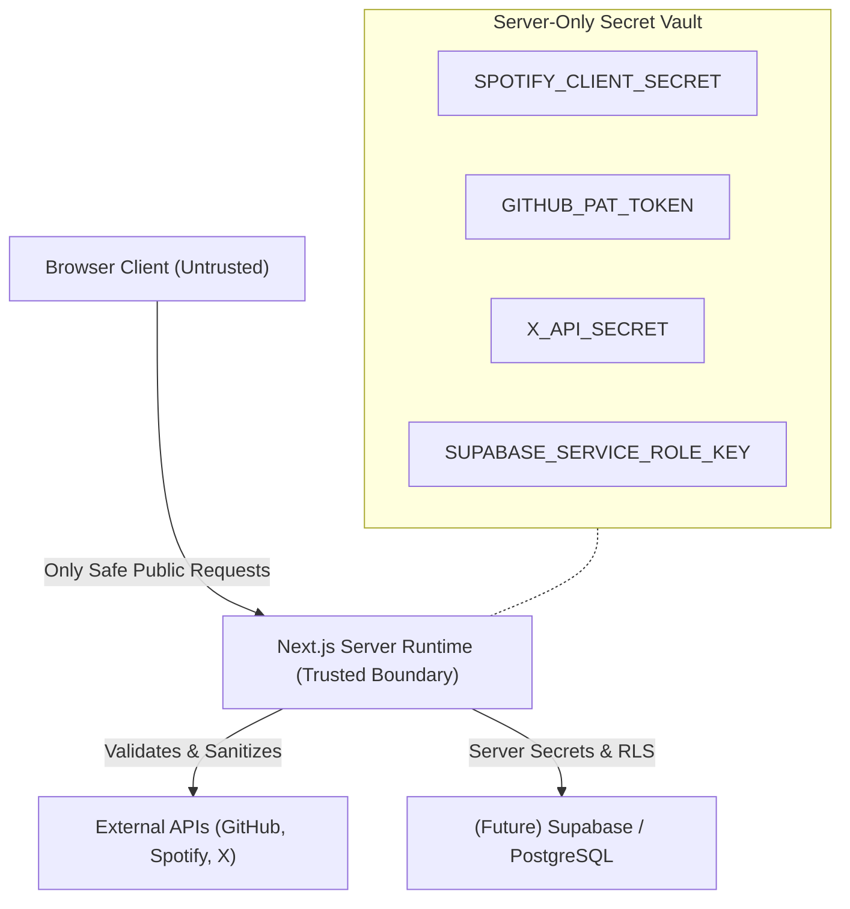
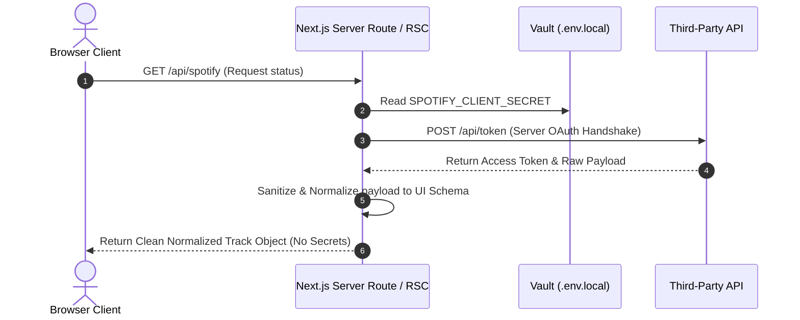
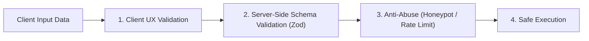

# Security Specification — Shreyansh Patni Portfolio

> [!IMPORTANT]
> **Source of Truth Hierarchy**:
> 1. User's Explicit Security Mandate
> 2. **`SECURITY.md` (This Document)**
> 3. [`ARCHITECTURE.md`](file:///c:/Users/shrey/Downloads/shreyansh-portfolio/shreyansh-portfolio/docs/ARCHITECTURE.md)
> 4. [`PRD.md`](file:///c:/Users/shrey/Downloads/shreyansh-portfolio/shreyansh-portfolio/docs/PRD.md)
> 5. `AGENTS.md`

---

## 1. Security Objective & Architecture Boundary

The primary security goal is to maintain a **secure-by-default, zero-trust architecture** for the Shreyansh Patni portfolio while keeping operations clean and proportional to a Next.js App Router application.

---

## 2. Secrets & Environment Variables Governance

> [!CAUTION]
> **Strict Secret Isolation**: Never hardcode API keys, tokens, client secrets, or database credentials inside `.tsx`, `.ts`, `.js`, `.json`, `.md`, or `.env.example`.
> **NEVER** prefix private secrets with `NEXT_PUBLIC_`.

### 2.1 Environment Variable Classification Matrix

| Variable Type | Prefix | Environment | Safety Level | Example Variables |
| :--- | :--- | :--- | :--- | :--- |
| **Private Server Secret** | None | Server Runtime Only (`.env.local`) | **STRICT PRIVATE** | `SPOTIFY_CLIENT_SECRET`, `GITHUB_TOKEN`, `DATABASE_URL` |
| **Public Configuration** | `NEXT_PUBLIC_` | Bundled to Browser Client | **PUBLIC SAFE** | `NEXT_PUBLIC_SITE_URL`, `NEXT_PUBLIC_ANALYTICS_ID` |

### 2.2 Git Safety & Leak Protocol
If a secret is inadvertently committed:
1. **Immediate Revocation**: Immediately revoke/rotate the secret at the provider console (GitHub, Spotify, Vercel).
2. **History Cleanup**: Scrub the repository history (`git filter-repo` or BFG Repo-Cleaner).
3. **Environment Audit**: Update local `.env.local` and Vercel Production Environment Variables with rotated keys.

---

## 3. Third-Party API Security Pipelines

External API integration credentials must remain isolated behind Next.js server-side adapters in `lib/`.

### 3.1 Provider-Specific Security Controls

| Integration | Security Requirement | Implementation |
| :--- | :--- | :--- |
| **GitHub Integration** | Read-Only Scoping | Store `GITHUB_TOKEN` server-side; request only `public_repo` read access. |
| **Spotify Integration** | OAuth Handshake Isolation | Perform token refresh on server; expose only track name, artist, & album cover. |
| **X / Twitter Integration** | Token & Key Shielding | Process feeds server-side; strip internal user IDs or raw tokens. |

---

## 4. Input Validation & Form Protection Strategy

All browser-supplied data (contact forms, query parameters, dynamic route slugs) is treated as **untrusted**.

### 4.1 Defense Layer Specification

| Protection Layer | Purpose | Technical Control |
| :--- | :--- | :--- |
| **Server-Side Validation** | Enforce data schemas regardless of client bypass | Zod schema validation on Server Actions / API Routes |
| **Anti-Spam & Honeypot** | Block automated form bot submissions | Silent hidden honeypot fields & Turnstile / CAPTCHA |
| **Rate Limiting** | Prevent Denial of Service & API abuse | Edge rate-limiting middleware on public endpoints |
| **XSS Prevention** | Prevent malicious script injection | Next.js automatic JSX escaping; sanitize MDX content |

---

## 5. Future Dynamic Feature Security (Database & Auth)

### 5.1 Supabase & PostgreSQL Security Rules
When introducing persistent database features (contact submissions, leads):
1. **Row Level Security (RLS)**: Enable RLS on all PostgreSQL tables.
2. **Service Role Key Shielding**: `SUPABASE_SERVICE_ROLE_KEY` must **NEVER** be sent to or accessible by client components.
3. **Parameterized Queries**: Execute all queries using official Supabase SDK methods or parameterized SQL to eliminate SQL injection.

### 5.2 Safe Error Handling & Logging
- **Sanitized Client Errors**: Never return raw database connection strings, internal file paths, or stack traces in production API responses.
- **Redacted Logging**: Ensure logger adapters automatically redact passwords, API keys, and access tokens before emitting logs.

---

## 6. Pre-Flight Security Review Checklist

Before releasing any new feature or API integration:

- [ ] **Secrets Audit**: Are all API keys stored exclusively in server `.env.local` without `NEXT_PUBLIC_` prefixes?
- [ ] **Git Safety Check**: Is `.env.local` listed inside `.gitignore`?
- [ ] **Boundary Verification**: Does third-party API data pass through server-side normalization before UI rendering?
- [ ] **Input Sanitization**: Is user input validated on the server with Zod or equivalent schemas?
- [ ] **Error Safety**: Do production error handlers swallow sensitive tracebacks and stack details?
- [ ] **Dependency Audit**: Are newly added npm packages verified, maintained, and audit-clean (`npm audit`)?
